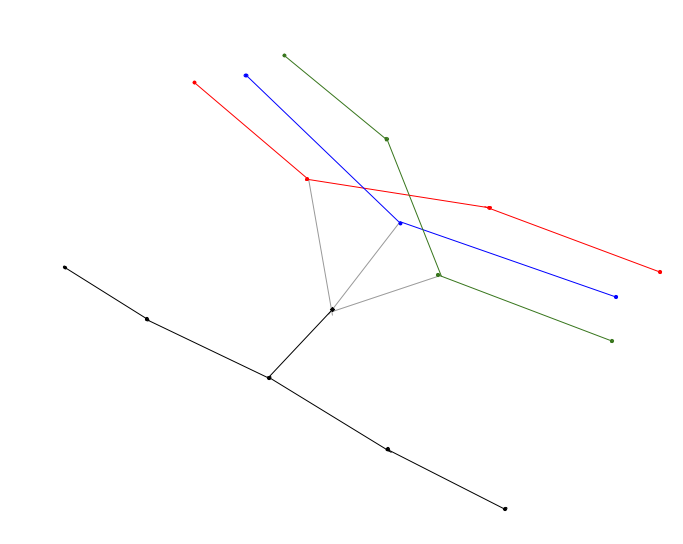

# Cinebus

Tria la teva pel·lícula, puja al bus i gaudeix del viatge cinematogràfic! 🚌 🎞️
## Comencem

### Què és Cinebus?
Cinebus és una aplicació que et permet escollir una de les pel·lícules disponibles als cinemes de Barcelona i et calcula la ruta des de la teva posició fins al cinema on es reprodueix aquesta pel·lícula per així poder gaudir-la! Per anar d'un punt a un altre, hauràs d'anar caminant o en bus així que prepara la teva T-Mobilitat! 💳

### Requisits previs
Per poder usar l'aplicació és tan senzill com haver instal·lat les llibreries que consten a `requirements.txt` amb la seva respectiva versió i executar l'arxiu `demo.py` en qualsevol versió de Python3 tant en Windows on. No és necessari res més! 😀

### Instal·lació
Tal com s'ha explicat anteriorment, l'únic que s'ha de fer és instal·lar totes les llibreries, encara que moltes d'aquestes ja venen amb la llibreria estàndard a l'instalar Python. Així doncs, haurem d'executar les següents instruccions a la terminal:
* En Windows:
```
pip install -r requirements.txt

```
* En Linux:
```
pip3 install -r requirements.txt
```
 
### Execució
Per executar el programa, només hem d'anar al directori on hem tenim el fitxer de l'aplicació i executar 
* En Windows:
```
python demo.py
```
* En linux:
```
python3 demo.py
```

## Implementació

L'aplicació consta de quatre mòduls: `billboard.py`, `buses.py`, `city.py` i `demo.py`. A continuació, s'explica detalladament com s'han implementat cadascú. 

### billboard.py
La funció principal d'aquest mòdul és llegir les dades relatives a la cartellera de cinemes de Barcelona i cercar-les. Mitjançant tècniques de web scraping i utilitzant la llibreria `BeautifulSoup` s'han pogut obtenir totes les dades rellevants. Noti's que s'ha tingut en compte els possibles errors que es puguin donar a l'hora d'accedir a la pàgina web, no accedir-hi per exemple, i per això s'ha creat la classe `PageNotFound`. Si no s'accedeix a la informació exitosament, es llença aquesta mateixa excepció.

Per guardar tota aquesta informació, s'utilitzen aquestes dataclasses: `Cinema`, `Film`, `Projection` i `Billboard`. En aquesta última, es guarda tota la informació.
Noti's que s'ha suprimit la funció `read`, ja que hem pensat que implementar-la dins de la funció `__init__` de la classe billboard era més intuïtiu i quedava més net. Per tant, en comptes de fer `billboard = read()`, només cal fer `billboard = Billboard()`.

Per a poder obtenir les coordenades de cada cinema, hem decidit crear un diccionari amb els noms de tots els cinemes de Barcelona i les seves coordenades corresponents. D'aquesta manera, aconseguim dues coses: filtrar tots els cinemes que no es troben dins de Barcelona, i afegir la seca localització a cada cinema.
Cal comentar que vam intentar obtenir la localització a partir de l'adreça de cada cinema usant llibreries externes, però en molts casos aquests mètodes no donaven resultats satisfactoris.

Finalment, també s'han implementat altres funcions que són necessàries en el `demo.py` en aquest mateix mòdul. També, altres funcions auxiliars que són útils a l'hora de cercar pel·lícules o projeccions.


### buses.py
La idea principal d'aquest mòdul és crear un graf de busos a partir de dades d'informació sobre línies d'autobús i les seves parades. En general, tant el graf de busos com el de ciutat contenen informació tant en els nodes com classes `Node` i en les arestes com classes `Aresta`. Tots els nodes estan definits com a subclasses de `Node`, i el paràmetre `info` de totes les arestes sempre serà un objecte subclasse de `Aresta`.

La funció estrella d'aquest mòdul és `get_buses_graph` que retorna el graf de busos, un graf dirigit. Els nodes d'aquest són tots objectes de la classe `Parada` i totes les arestes tenen un atribut `info` de tipus `Bus`.

Hem decidit crear un graf de busos dirigit, ja que, en general, els busos no passen per les mateixes parades a l'anada i a la tornada. Així per trobar el camí més curt entre dos punts podrem tenir en compte el sentit en el qual van les línies del bus i, com és intuïtiu, el camí d'anada serà diferent del de tornada.

Els nodes del graf, de tipus `Parada`, només tenen associada una única línia de bus, ja que així podrem tenir en compte quan canviem de línia per a calcular el camí més curt.
Com veurem més endavant, per poder ajuntar totes les parades que es troben físicament al mateix lloc, i tractar-les com una sola unitat, utilitzarem la classe `MultiParada`, que és superclasse de `Parada`.

Per poder buscar camins curts, que ho necessitarem pel graf de la ciutat, hem afegit un paràmetre `time` a cada aresta que ens indica el temps que trigaríem a recórrer aquella aresta, i que actuarà com el pes de l'aresta. També hem definit les constants `BUS_SPEED` i `BUS_STOP_TIME` que representen la velocitat mitjana del bus i el temps mitjà que un bus s'ha d'esperar quan arriba a cada parada.

Per últim, ens fa falta saber la distància que ha de recórrer el bus per anar d'una parada a una altra. Per fer això, descarreguem el graf de carreteres de Barcelona, anomenat `RoadGraph`, i considerem que la distància entre dues parades, que anomenarem longitud de l'aresta, és la mínima distància sobre el RoadGraph entre els dos nodes més propers a aquestes dues parades. Tot i que aquesta distància és una aproximació, és millor que considerar la distància en línia recta entre qualssevol dues parades.
Així doncs, podem calcular els pesos `time` de cada aresta del graf de busos, d'una manera prou exacta.

Per poder mostrar el graf de busos d'una manera entenedora i exacta, hem fet que a cada línia li correspongui un color diferent. Això s'ha implementat utilitzant un generador de colors pseudoaleatoris.
També, per no mostrar cada aresta com una línia recta entre dues parades, hem guardat les coordenades dels nodes del RoadGraph pel qual passava el camí més curt calculat anteriorment, i hem fet que cada aresta es mostri com la unió de les arestes corresponents camí mínim.


### city.py
Aquest mòdul crea el mapa de la ciutat de Barcelona, el `CityGraph` que no deixa de ser un graf dirigit, `nx.DiGraph`. De manera similar al graf de busos, en el cas del graf de la ciutat, els nodes del graf seran de tipus `Cruilla`, `Parada` o `MultiParada`, tots subclasses de `Node`.

Els nodes `Cruilla` representen cruïlles donades pel graf osmnx de Barcelona i els de tipus `Parada` són exactament els mateixos que els del graf de busos. Per poder controlar quan un camí del graf va per una mateixa línia de bus, i quan fa transbord a una altra, hem emprat la classe `MultiParada`. Podem entendre aquests nodes com la representació d'una parada de bus física, o com la "unió" de totes les parades que tenen les mateixes coordenades.
Més endavant expandirem sobre la seva funcionalitat i el perquè d'aquesta tria.

Les arestes del nostre graf seran de tipus `Carrer`, `Bus` o `Transbord`. Els `Carrers` sempre uniran o bé dues Cruïlles, o bé una Cruïlla amb una `Multiparada`. Aquest segon tipus de 'Carrers' és el que ens permet, en part, moure'ns del graf osmnx al graf de busos.
Les arestes de tipus `Bus`, com hem vist, uniran les Parades de bus.
Per últim, els `Transbords` uniran una `MultiParda` amb una `Parada`. És a dir, passar per una aresta `Transbord` significarà agafar o baixar d'un bus, sigui per agafar-ne un altre o no. Per tant, aquestes arestes tindran un pes `time` donat, però no tindran longitud, ja que no indiquen cap desplaçament.

Per calcular els pesos que ha de tenir cada aresta, considerarem una aproximació del temps que trigaríem a recórrer-la. A les arestes `Carrer`, les assignem un pes `time` proporcional a la seva longitud, fent ús de la constant `WALKING_SPEED`. La longitud d'aquestes arestes serà definida per la longitud al graf osmnx.
Com ja hem vist abans, a les arestes de tipus `Bus` les assignem un temps inicial, ja que el bus ha de parar a cada parada, i després un temps proporcional a la longitud, per les carreteres de Barcelona, del camí més curt entre les dues parades. La longitud d'aquestes arestes serà la longitud d'aquest camí més curt.
Finalment, els nodes `Transbord` poden tenir dos pesos diferents. Com es tracta d'un graf dirigit, definim el pes d'anar d'una MultiParada a una Parada com constant, indicant el temps que hem d'esperar per agafar el bus. En la nostra implementació aquest temps era `BUS_WAITING_TIME = 300` segons. D'altra banda,el pes des d'una Parada a una MultiParada, serà de 0 segons, indicant que per baixar del bus no hem d'esperar res.
La longitud d'una aresta de tipus `Transbord` serà zero en tots casos.

Els 6 diferents nodes i arestes es poden veure en el següent diagrama:

Les arestes negres són Carrers, les grises, Transbords, i les de color són de tipus Bus.
El node de tipus `Multiparada` és el que es troba al mig, i és el que permet unir les Parades amb les Cruïlles. Com veiem, per fer transbord no haurem de passar mai per cap aresta de tipus carrer i, per tant, podrem obtenir la distància recorreguda per qualsevol camí correctament.

A l'hora de mostrar el graf de la ciutat, per mostrar les arestes de tipus `Bus`, utilitzem la mateixa estratègia que fèiem amb el graf de busos, i ignorem les arestes de tipus `Transbord`, ja que no mostren cap desplaçament en l'espai.

També caldria notar l'ús de fitxers json per a emmagatzemar els grafs, perquè així no s'hagin de descarregar ni crear cada com que executem la nostra aplicació.

Una altra part important del mòdul city és la implementació de la cerca del camí més curt.
Per aconseguir-ho, el que hem fet ha estat trobar els dos nodes que es troben més a prop de l'origen i el destí indicats, i amb les funcions que ens proporciona la llibreria networkx hem trobat el camí més curt.
Per a poder emmagatzemar el camí, hem decidit crear una classe `Path`, que té emmagatzemades les coordenades d'origen i destí, així com una llista dels nodes que formen part d'aquest camí mínim, i també la durada, distància total, i distància recorreguda a peu del camí mínim. Aquests paràmetres són útils de cara a mostrar el camí a l'usuari.
També, per si no era prou entenedor un diagrama del camí en si, hem implementat la funció `obtenir_indicacions` que, donat un camí, entre altres coses, fa un llistat de les indicacions que hauríem de seguir per arribar al nostre destí, com ara caminar per un carrer fins a un altre, agafar una determinada línia de bus una parada, o bé fer transbord d'una parada a una altra.


### demo.py
El mòdul `demo.py` mostra totes les funcions que s'han anat fent de manera gràfica i interactiva. Mitjançant una Graphical User Interface (GUI) implementada gràcies a la llibreria `tkinter`, l'aplicació compte amb tres funcionalitats clares: mostrar la cartellera on primer apareixen les pel·lícules que es reproduiran més aviat i més informació rellevant, mostrar els mapes de busos i el de la ciutat i per últim mostrar el camí per anar a veure una pel·lícula desitjada des d'un lloc donat en un moment donat.

Per dissenyar la interfície gràfica la classe, a resumits comptes, hem creat la classe `App` on conté l'arrel, la root principal del programa. Per anar afegint frames a la root, s'ha de crear una classe per a cada frame nou. Cada classe representa un frame que hereda de `tk.Frame` i s'instancien a la root de la classe `App`. Els atributs de cada frame s'inicialitzen amb `tk.Frame.__init__(self, root)`. Per exemple, `class PageBillboard(tk.Frame)` és la classe que mostra la cartellera.

Per facilitar, la implementació de `demo.py`, hem declarat variables a la classe `App` les quals són accessibles per la resta de classes. D'aquesta manera, si necessitem utilitzar funcions que poden trigar una mica més de temps només es fan un únic cop a l'iniciar el programa i ja són accessibles per la resta de classes en qualsevol moment. 

Més endavant veurem que una utilitat de la nostra aplicació és que, donada una pel·lícula, l'usuari obté totes les projeccions d'aquesta pel·lícula a les quals podria arribar si sortís en aquell mateix instant. En comptes de calcular un camí mínim cada cop que vulguem decidir si filtrar o no una projecció, hem decidit anar associant cada cinema amb la durada del camí fins a aquest, per així evitar operacions repetides. 


## Usabilitat

Tal com s'ha explicat, l'aplicació Cinebus té tres principals funcionalitats: mostrar la cartellera, mostrar els mapes de busos i el de la ciutat i mostrar el camí per anar a veure una pel·lícula desitjada des d'un lloc donat en un moment donat.

A continuació s'explicaren aquestes tres amb més detall.

### Cartellera

La cartellera mostra les pel·lícules en funció de l'hora en què es poden anar a veure, on les que es reproduiran més aviat apareixen abans. Hi ha un botó per cercar pelis: el botó `Cerca`. Aquest filtra les pel·lícules pel nom de la pel·lícula, pel nom del cinema on volem que es faci, per la direcció del cinema, per gèneres fílmics i pels noms dels actors que es volen buscar. Encara que al principi es mostren totes les projeccions sense cap mena de filtratge, si volem que torni a mostrar totes les projeccions una vegada s'ha filtrat, només cal tornar a fer clic al botó `Cerca!` sense introduir cap paràmetre. 

Tanmateix, s'ha afegit una funcionalitat extra a l'aplicació que permet veure quins ciemes tenen a disposició més pel·lícules, en cas de no saber quina pel·lícula anar a veure tenir l'opció d'anar al cine on hi ha més pel·lícules. 

### El graf de Barcelona i el graf de busos
En segon lloc, l'aplicació també mostra el graf de busos de la ciutat de Barcelona on cada línia de Bus ve representada per un color diferent. 

De la mateixa manera, també podem veure el graf de la ciutat de Barcelona, on venen representades les línies de busos i els carrers en color gris. Apa, ja podem anar a qualsevol lloc caminant o en bus!

### Buscar per pel·lícula
L'aplicació té un mètode que permet a l'usuari buscar una pel·lícula. Només cal introduir les coordenades d'on vol sortir per anar al cinema i el nom de la pel·lícula que vol anar a veure. A continuació, surt un llistat de pel·lícules noms dels quals coincideix amb el nom introduït. Una vegada s'ha seleccionat a quina pel·lícula específica es vol anar, surt un llistat de projeccions on s'ha d'escollir quin és el que millor convé, ja que encara que totes les projeccions tinguin la mateixa pel·lícula, cada una pot tenir un cine i l'hora de projecció diferent. Hem pensat en només mostrar les pel·lícules a les quals arribaria l'usuari calculant el `Path` de tots els cinemes.

Una vegada tenim que l'usuari ha escollit la projecció, l'aplicació mostra el camí que va de les coordenades inicials fins al cinema on es reprodueix la projecció que s'ha triat. A més a més, s'obre una finestra on surten les indicacions que s'han d'anar fent per arribar al destí, com si fos Google Maps!🗺️ Finalment, també podem tenir l'opció del camí de tornada a les coordenades inicials, ja que una vegada hem vist la pel·lícula hem de tornar a casa... 🏠


## Autors
* Gerard Grau Garcia
* Pol Resina Martínez